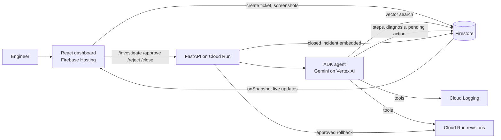

# Architecture (for the deck)

```mermaid
flowchart LR
  U[Engineer] --> D[React dashboard<br/>Firebase Hosting]
  D -->|create ticket, screenshots| FS[(Firestore)]
  D -->|/investigate /approve /reject /close| API[FastAPI on Cloud Run]
  API --> AG[ADK agent<br/>Gemini on Vertex AI]
  AG -->|tools| LOG[Cloud Logging]
  AG -->|tools| CR[Cloud Run revisions]
  AG -->|vector search| FS
  AG -->|steps, diagnosis, pending action| FS
  API -->|approved rollback| CR
  FS -->|onSnapshot live updates| D
  API -->|closed incident embedded| FS
```

Key point: the agent can only propose an action. Rollback runs in the approval endpoint, so human approval is enforced in code.
